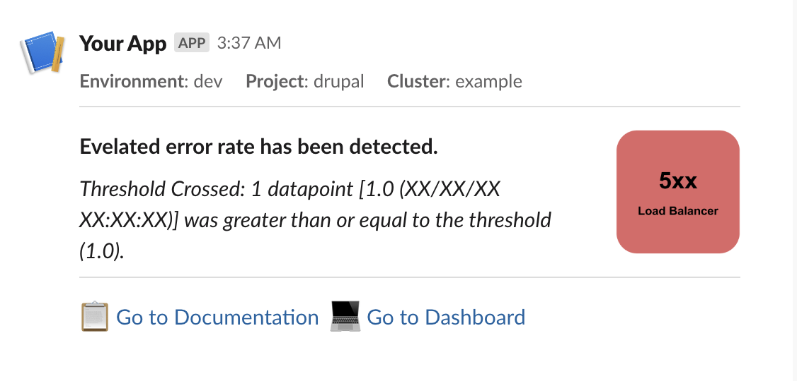

# CloudWatch Slack Lambda

A Lambda function for notifying Slack channels when a CloudWatch Alarm is triggered.

## Example

Below is an example Slack message driven by data provided by:

* The CloudWatch Alarm event
* Tags set on the CloudWatch Alarm

## Tags

The following tags are used to configure the Slack message.

| Name                       | Description                                                                |
|----------------------------|----------------------------------------------------------------------------|
| skpr.io/cluster            | The name of the cluster which this CloudWatch Alarm is associated with     |
| skpr.io/project            | The project which this CloudWatch Alarm is associated with                 |
| skpr.io/environment        | The environment which this CloudWatch Alarm is associated with             |
| skpr.io/instance           | A fallback tag to be used when project and environment are not appropriate |
| skpr.io/link/dashboard     | A link to a dashboard which can provide context to the CloudWatch Alarm    |
| skpr.io/link/documentation | A link to documentation which can provide context to the CloudWatch Alarm  |
| skpr.io/asset/icon         | A link to an icon which can provide context to the Slack message           |
